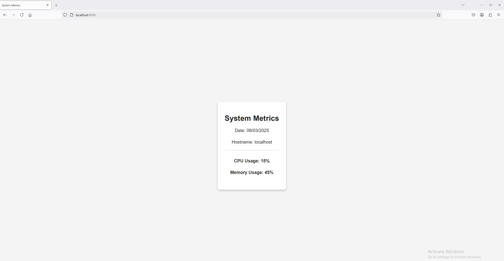
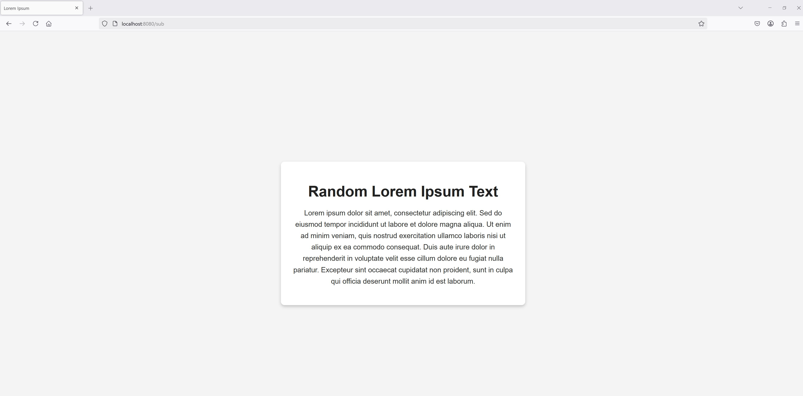
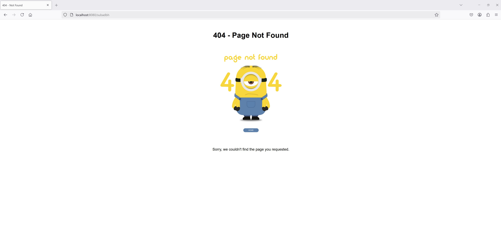

# Sample Web App
- [Docker Registry](https://hub.docker.com/repositories/ssubhash001)

## Repository Contents

- **GitHub Workflow**: Automates the secure build of the web app and pushes it to Docker Hub.
- **Deployment Workflows**: Includes workflows to deploy the app to a hosted service like AWS in a secure way.
- **Terraform Modules**: Contains root and child Terraform modules to provision cloud infrastructure. (Not tested due to account limitations, but logic is implemented)
- **Source Code & Dockerfile**: Includes the web app source code, configration files and a Dockerfile to build the application.

## Clone the Repository And Run
```sh
docker-compose up
``` 
The app should be accessible at http://localhost:8080.


### Expected Output
 
#### When you visit [http://localhost:8080](http://localhost:8080), you should see an output similar to the image below:




#### When you visit [http://localhost:8080/sub](http://localhost:8080/sub), you should see an output similar to the image below:




#### When you visit [http://localhost:8080/subadbh](http://localhost:8080/subadbh), you should see an output similar to the image below:


